# System Architecture

## Architecture Diagram

```mermaid
graph TB
    subgraph "Client Layer"
        UI[React Frontend]
        Monaco[Monaco Editor]
        Extensions[Extension Host]
    end
    
    subgraph "API Gateway"
        Gateway[API Gateway/Load Balancer]
        Auth[Auth Service]
        RateLimit[Rate Limiting]
    end
    
    subgraph "Core Services"
        API[Main API Server]
        FileService[File Service]
        WorkspaceService[Workspace Service]
        UserService[User Service]
    end
    
    subgraph "AI Services"
        AIProxy[AI Proxy Service]
        OpenAI[OpenAI API]
        Gemini[Google Gemini API]
        SharedAI[Shared AI Pool]
    end
    
    subgraph "Compilation Services"
        CompileAPI[Compile API]
        Judge0[Judge0 Containers]
        CustomRunners[Custom Language Runners]
        ResourceMonitor[Resource Monitor]
    end
    
    subgraph "Extension Services"
        LSPProxy[LSP Proxy]
        DAPProxy[DAP Proxy]
        ExtensionStore[Extension Store]
        ExtensionRuntime[Extension Runtime]
    end
    
    subgraph "Data Layer"
        PostgreSQL[(PostgreSQL)]
        Redis[(Redis Cache)]
        S3[(File Storage)]
        Logs[(Log Storage)]
    end
    
    subgraph "External Services"
        GitHub[GitHub OAuth]
        Google[Google OAuth]
        Monitoring[Monitoring/Alerts]
    end
    
    UI --> Gateway
    Monaco --> Extensions
    Extensions --> LSPProxy
    Extensions --> DAPProxy
    
    Gateway --> Auth
    Gateway --> RateLimit
    Gateway --> API
    
    Auth --> GitHub
    Auth --> Google
    
    API --> FileService
    API --> WorkspaceService
    API --> UserService
    API --> AIProxy
    API --> CompileAPI
    
    AIProxy --> OpenAI
    AIProxy --> Gemini
    AIProxy --> SharedAI
    
    CompileAPI --> Judge0
    CompileAPI --> CustomRunners
    CompileAPI --> ResourceMonitor
    
    FileService --> S3
    WorkspaceService --> PostgreSQL
    UserService --> PostgreSQL
    
    API --> Redis
    API --> Logs
    
    LSPProxy --> ExtensionRuntime
    DAPProxy --> ExtensionRuntime
    ExtensionStore --> PostgreSQL
    
    Monitoring --> Logs
    Monitoring --> PostgreSQL
    Monitoring --> Redis
```



## Component Details

### Frontend Architecture

**React Application Structure:**
```
src/
├── components/
│   ├── Editor/           # Monaco wrapper and editor logic
│   ├── FileExplorer/     # File tree and project navigation
│   ├── Terminal/         # Integrated terminal component
│   ├── AIChat/           # AI assistance interface
│   └── Layout/           # Main layout components
├── services/
│   ├── api.ts           # API client
│   ├── auth.ts          # Authentication logic
│   ├── compiler.ts      # Compilation service
│   └── ai.ts            # AI service integration
├── stores/
│   ├── editor.ts        # Editor state management
│   ├── workspace.ts     # Workspace and file state
│   └── user.ts          # User and auth state
└── hooks/
    ├── useCompiler.ts   # Compilation hooks
    ├── useAI.ts         # AI integration hooks
    └── useExtensions.ts # Extension system hooks
```

### Backend Services

**Main API Server (Node.js + Express):**
- RESTful API with OpenAPI 3.0 specification
- JWT-based authentication with OAuth integration
- WebSocket support for real-time features
- Rate limiting and request validation
- Comprehensive logging and monitoring

**Compilation Service:**
- Containerized execution environment
- Resource limits (CPU, memory, time)
- Language-specific runners
- Security sandboxing with Docker
- Result caching and optimization

**AI Proxy Service:**
- Multi-provider routing logic
- User API key management
- Shared quota enforcement
- Response caching and optimization
- Usage analytics and billing

### Data Architecture

**PostgreSQL Schema:**
```sql
-- Users and authentication
users (id, email, oauth_provider, oauth_id, created_at, updated_at)
user_tokens (user_id, provider, encrypted_token, expires_at)

-- Workspaces and projects
workspaces (id, user_id, name, settings, created_at, updated_at)
files (id, workspace_id, path, content_hash, size, created_at, updated_at)

-- AI usage tracking
ai_usage (user_id, provider, requests_count, tokens_used, date)

-- Extensions and marketplace
extensions (id, name, version, manifest, author_id, published_at)
user_extensions (user_id, extension_id, enabled, settings)
```

**Redis Caching Strategy:**
- Session storage and JWT tokens
- Compilation result caching
- AI response caching
- Rate limiting counters
- Real-time collaboration state

### Security Architecture

**Sandboxing Strategy:**
- Docker containers with restricted capabilities
- Network isolation and egress filtering
- Resource limits (CPU: 1 core, RAM: 512MB, Time: 30s)
- Filesystem isolation with read-only base images
- Process monitoring and automatic termination

**Authentication & Authorization:**
- OAuth 2.0 with PKCE for client authentication
- JWT tokens with short expiration (15 minutes)
- Refresh token rotation
- API key encryption at rest
- Role-based access control (RBAC)

**Extension Security:**
- Manifest-based permission model
- Sandboxed execution environment
- API surface area restrictions
- Code signing for marketplace extensions
- Runtime permission prompts

## Deployment Architecture

### Development Environment
```yaml
# docker-compose.yml
services:
  frontend:
    build: ./frontend
    ports: ["3000:3000"]
  
  backend:
    build: ./backend
    ports: ["8000:8000"]
    depends_on: [postgres, redis]
  
  postgres:
    image: postgres:15
    environment:
      POSTGRES_DB: ai_ide
  
  redis:
    image: redis:7-alpine
  
  judge0:
    image: judge0/judge0:1.13.0
    privileged: true
```

### Production Environment (Kubernetes)
- Multi-zone deployment for high availability
- Horizontal Pod Autoscaler for dynamic scaling
- Ingress controller with SSL termination
- Persistent volumes for database storage
- Service mesh for inter-service communication

## Performance Considerations

### Frontend Optimization
- Code splitting and lazy loading
- Monaco Editor web workers
- Virtual scrolling for large files
- Debounced API calls
- Service worker for offline capabilities

### Backend Optimization
- Connection pooling for databases
- Async/await patterns for I/O operations
- Response compression and caching
- Database query optimization
- CDN for static assets

### Compilation Optimization
- Container image caching
- Compilation result caching
- Parallel execution for multiple files
- Resource pooling and reuse
- Intelligent scheduling algorithms